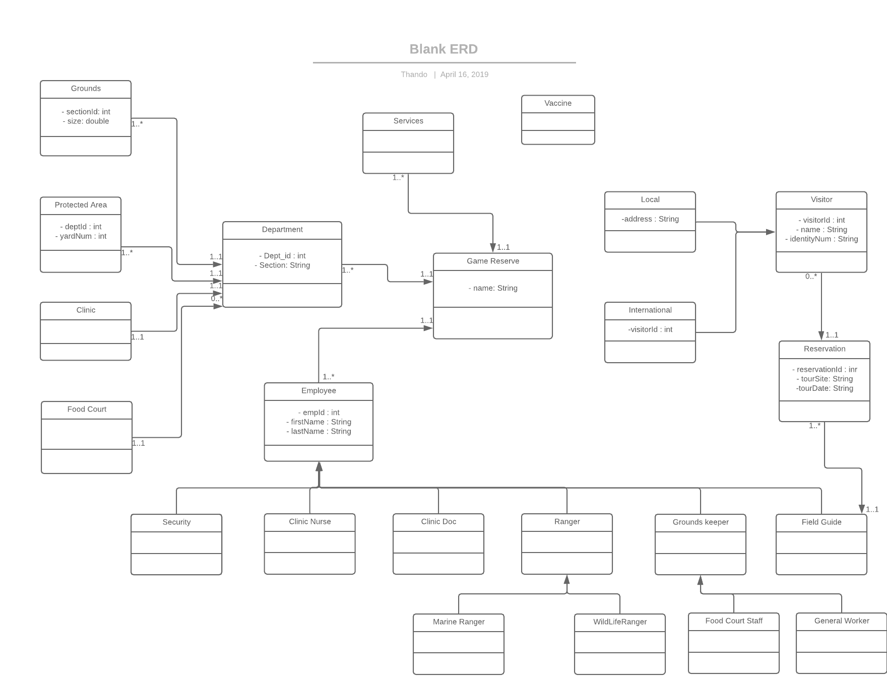

# Zoo_Crew

The aim of the system with which I am solving this domain, is to assist the game reserve working staff, 
to better manage their day to day operations and manage better the the human activities. 

## What will the system do?

- As the game reserve's tourist guides will be able to manage reservations for scheduled visits from international and local guests
- Will be able to store the game reserves equipment like the cars and suppliers for the food courts and gift stations
- Be able to generate monthly reports
- Access for the vet staff to keep track of animals brought in for vaccines
- .

